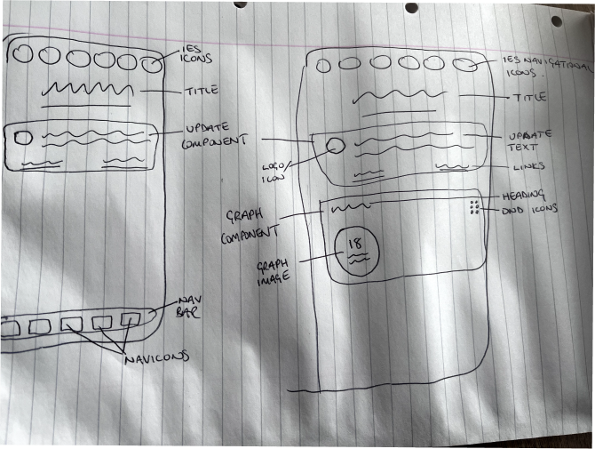

# IES_V0 - Energy Sensor Data Viewer

## Project Description

This project is a React Native application designed to display real-time data from sensors connected to the IES (Integrated Energy System). The application is intended for sideloading onto Apple devices and will visualise data from heat sensors, solar sensors, and possibly other environmental data sources.

The initial version (V0) of the project will focus on rendering basic graphs from dummy or preliminary data. Future versions may incorporate more complex features, such as live data updates, interactive data displays, and branding elements consistent with the existing systems pages.

## Installation and Setup

To run this project locally:

1. Clone the repository:
    ```bash
    git clone git@github.com:SelinaKionnali/IES_V0.git
    ```

2. Navigate to the project directory:
    ```bash
    cd IES_V0
    ```

3. Install dependencies:
    ```bash
    npm install
    ```

4. Run the application on an iOS simulator or device:
    ```bash
    npx react-native run-ios
    ```

This project is currently in the early stages, so additional setup instructions and dependencies may be added as development progresses.

## Preliminary Data and Features

### Data Sources
- Heat / solar sensors (preliminary data as of 12/07/24)
- Dummy data for initial graph rendering

### Features (V0)
- Display preliminary or dummy data in a simple graph
- Basic user interface for data visualization
- No backend integration at this stage

## Project Planning

### User Stories
- As a user, I want to see real-time data from the heat sensors.
- As a user, I want the app to match the branding of existing systems pages.

### Wireframes
The following wireframe provides a basic outline of the initial user interface design for the IES V0 application. This wireframe represents both the dashboard and individual IES section pages, showcasing the core components and navigation structure that will be implemented in the first version of the app.



### 1. **Dashboard Page**

- **Top Navigation (Circular Icons):**  
  At the top of the dashboard, there is a row of circular icons. Each icon represents a different part of the Integrated Energy System (IES), such as Water, Food, Thermal, Grey Water, and Power. These icons are interactive and allow users to navigate to the corresponding IES section pages.

- **Page Title:**  
  Below the circular icons, a title is displayed, such as "Dashboard". This title provides context for the current page and helps users understand which part of the app they are viewing.

- **General Info Component:**  
  Under the title, a large rectangular component is used to display general information or updates about the overall IES system. This component may include important notifications or a summary of the system's status.

- **Bottom Navigation Bar:**  
  The bottom of the screen contains a navigation bar that provides access to other key areas of the app, such as Home, Settings, and Profile. This bar is persistent across all pages for easy navigation.

### 2. **IES Section Pages (Water, Food, Thermal, etc.)**

- **Top Navigation (Circular Icons):**  
  The same row of circular icons from the dashboard page is present on each IES section page, allowing for quick navigation between different parts of the IES.

- **Section Title:**  
  A title specific to the selected IES section (e.g., "Water System", "Food System") is displayed below the icons. This title helps orient the user within the app and clearly indicates the section they are viewing.

- **Section Info Component:**  
  Each section page includes a large rectangular component that provides detailed information about the selected IES section. For example, the "Water System" page might show water levels, quality, and recent updates.

- **Graph Component:**  
  Below the information component, a graph is displayed to visualize relevant data for the selected section. This could include trends over time, such as water usage, solar energy captured, or temperature changes.

- **Bottom Navigation Bar:**  
  Just like on the dashboard, the bottom navigation bar remains consistent across all section pages, allowing users to easily access other parts of the app.

### Conclusion

This wireframe serves as a starting point for the visual and functional layout of the IES V0 application. The design prioritizes simplicity and ease of navigation, ensuring that users can quickly access and understand the data from the various sections of the Integrated Energy System.

### ERD (Entity Relationship Diagram)
The current ERD outlines the data structures for solar and heat sensors. This diagram will evolve as more data sources are integrated.

The following ERD represents the simplified data structure used in V0 of the IES Data Viewer application. This version focuses on visualizing basic thermal data from a single sensor type.

- **sensor**: Identifies the sensor collecting the data.
- **thermalData**: Captures the temperature data recorded by the sensor. For V0, this includes data such as `timestamp`, `coldTempIn`, `hotTempOut`, and `volumeLevel`.

### Simplified ERD for V0
    
```plaintext
sensor (sensorId, sensorType, locationId)
   |
   |-- thermalData (recordId, sensorId, timestamp, coldTempIn, hotTempOut, volumeLevel)
```

## Demo and Deployment

The app is currently not deployed.

## Technologies Used

- React Native
- Node.js (for future backend integration)
- Expo (for development and testing)

## Future Enhancements

- Live data integration with the IES system
- Improved UI/UX with system branding- Expanded data visualization features (e.g., multiple graphs, data comparisons)
- User interaction features:
    -  Drag and drop functionality
    -  Graph data comparisons
